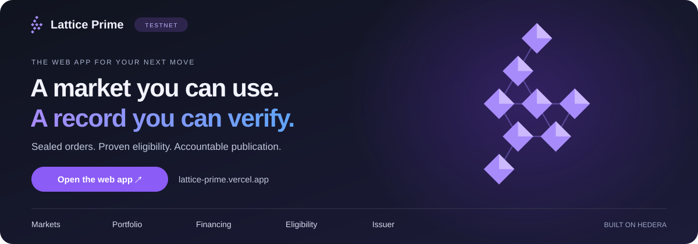
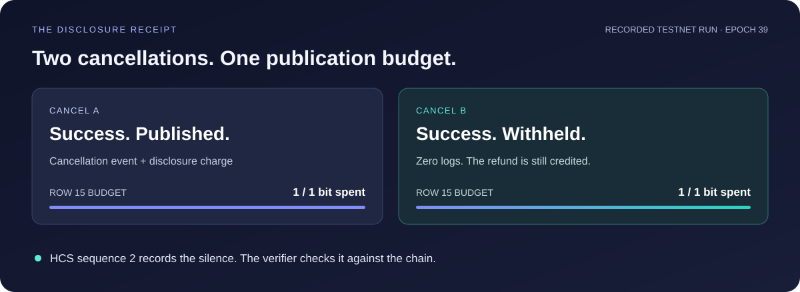
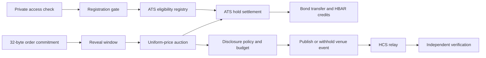

<div align="center">

# Lattice Prime

### Trade tokenised bonds. Shield your next move.

**A working bond market on Hedera, with sealed orders, zero-knowledge eligibility, and receipts for what the venue discloses.**

[](https://lattice-prime.vercel.app)

[Markets](https://lattice-prime.vercel.app/trade.html) · [Portfolio](https://lattice-prime.vercel.app/position.html) · [Financing](https://lattice-prime.vercel.app/repo.html) · [Eligibility](https://lattice-prime.vercel.app/prove.html) · [Issuer](https://lattice-prime.vercel.app/venue.html)

[](venue/deployments/README.md)
[](https://github.com/hashgraph/asset-tokenization-studio/tree/v8.0.0)
[](venue/circuits/kyc.circom)
[](LICENSE)

</div>

[](https://lattice-prime.vercel.app)

**[Open Lattice Prime →](https://lattice-prime.vercel.app)** Browse without a wallet. Connect an EVM wallet with test HBAR when you want to act. This is a Hedera testnet demonstration using an ATS-issued test bond, not a live financial product.

**Start here:** [Explore the app](#explore-the-app) · [The receipt](#a-venue-that-can-account-for-its-silence) · [Hedera integration](#built-around-hedera) · [Run locally](#run-locally) · [Pitch guide](docs/PITCH.md)

## Tokenisation is the beginning. What happens after issuance?

A bond needs somewhere to trade, a way to check who can hold it, a price for collateral, and a lifecycle that keeps working after the first transfer. Traders also need to know what their venue reveals about them.

**Lattice Prime takes an ATS-issued bond into a secondary market and makes the venue's own disclosures accountable.** Its repo implementation extends that lifecycle into financing against bond collateral. A repo is short-term funding backed by securities.

The problem has a history. In 2016, the SEC found that Credit Suisse transmitted confidential subscriber order information outside its dark pool. A confidentiality promise had not prevented the operator from using the information it held. [SEC enforcement release](https://www.sec.gov/newsroom/press-releases/2016-16).

The market already has scale: Broadridge reported **$7.5 trillion in repo transaction volume during June 2026** on its Distributed Ledger Repo platform. That is category activity, not Lattice Prime's volume or addressable revenue. [Broadridge's July 2026 release](https://www.broadridge.com/press-release/2026/broadridges-dlr-processes-over-7-trillion-in-june).

## Explore the app

The names below are the names in the app. Go straight from an explanation to the screen that implements it.

- **[Markets](https://lattice-prime.vercel.app/trade.html): place a sealed order.** Inspect LPRC, its price reference and auction clock. The app encrypts the reveal key on the device, sequences sell reservation when needed, and keeps the next action in the order panel. Both sides clear at a uniform auction price.
- **[Portfolio](https://lattice-prime.vercel.app/position.html): follow your position.** Read available and held bond balances, settlement credits, and coupon information for the selected account.
- **[Financing](https://lattice-prime.vercel.app/repo.html): fund against tokenised collateral.** RepoVault v5 is bound live. Eligible lenders can fund offers, named borrowers can accept them against ATS holds, and both parties can follow margin, coupon, fail, close, and default evidence.
- **[Eligibility](https://lattice-prime.vercel.app/prove.html): confirm private access.** Connect a matching wallet and one action restores its account-bound proof, checks the live policy, and asks the venue relay to sponsor registration. Proof import and public signals remain available under recovery details.
- **[Issuer](https://lattice-prime.vercel.app/venue.html): inspect the venue's rules.** Read governance, policy, published disclosures, and the HCS record. Follow the evidence out to Hedera and verify it independently.

The app's **README** links bring you back here for the mechanism, setup, and evidence behind those screens.

## A venue that can account for its silence

**The memorable demo takes two cancellations.**

In the recorded testnet run, activity row 15 has a one-bit publication budget for the epoch. Both orders are cancelled successfully:

1. **Cancel A:** the venue publishes the cancellation and spends the available bit.
2. **Cancel B:** the cancellation succeeds, the refund is credited, and the venue emits no logs. The publication budget is exhausted.
3. **Read the receipt:** `spentBits` remains at one. A separate HCS `silence` record identifies the successful transaction and the policy that withheld its venue event.

**The action completed. The venue stopped talking. You can check both.**

[](venue/deployments/receipt-beat.json)

This visual summarises [recorded testnet evidence](venue/deployments/receipt-beat.json). It is not a live counter. [Inspect the HCS record in the app →](https://lattice-prime.vercel.app/venue.html#hcs-record)

<details>
<summary><strong>Verify the demonstration yourself</strong></summary>

- [First cancellation on HashScan](https://hashscan.io/testnet/transaction/0xa7e2287bec0fadcdeccc3c3484acab1d081eae2a6eca219b20b76b80c41950f3): success, cancellation and disclosure-charge logs, 118,154 gas.
- [Second cancellation on HashScan](https://hashscan.io/testnet/transaction/0x2885d8da867b1cab43863698895a2bf78fb35114743a33849ba5f771cc707594): success, zero logs, 60,090 gas.
- [HCS topic 0.0.10397186](https://hashscan.io/testnet/topic/0.0.10397186): the ordered disclosure record, including the silence at sequence 2.
- [Saved HCS verification](venue/deployments/hcs-verify.json): **2,002 assertions, zero failures**, recorded on 10 September 2026 over 220 messages, including two range anchors whose hashes were recomputed from 2,376 `spentBits` cells read off the contracts. Re-run the verifier to check the current topic.
- [Committed HCS index](venue/deployments/hcs-index.json): the topic replayed into the projection the Issuer screen boots from. The verifier rebuilds it from the mirror node and fails if the two disagree.
- [Completed auction settlement](https://hashscan.io/testnet/transaction/0x82f439ba50b8d575e5207bb3431852679a7b248568cebdd01104113e6081cb68): [deployment evidence](venue/deployments/296-venue.json) records 1,000 bond units crossing at a uniform price between the two limits.
- [Source verification records](venue/deployments/296-venue.json): the `sourcify` section identifies verified contract releases. The current source and the deployed release are distinguished below.

The relay's claims are checked against transaction receipts, governed budgets, and contract state. It can stall; HCS does not guarantee relay liveness or make its assertions true by itself. [Verifier design and scope](venue/docs/HCS.md).

</details>

## How a trade works

**Access → Commit → Reveal → Settle → Verify**



**Confirm access.** A PLONK circuit checks credential membership, expiry, tier, and jurisdiction. The registration gate pins the issuer root, epoch, account, and required policy. The user sees one private-access action, while the venue relay can pay for registration. ATS reads the resulting eligibility grant at its supported transfer checks.

**Seal the intent.** Side, price, quantity, and salt are absent from the commit call. Cancellation closes when reveal opens, preventing a trader from observing a reveal and then cancelling within that same order's cancellation window.

**Settle the trade.** The auction chooses a uniform clearing price and settles supported pairs against ATS holds and buyer escrow. Proceeds and refunds become withdrawable credits. Eligibility and settlement refusals remain explicit.

**Account for publication.** The lattice defines permitted granularity and timing. Metered rows also have per-epoch budgets. Budget exhaustion withholds the venue event while the permitted action completes. Strict ceiling violations can refuse an action; cash and collateral recovery paths use a non-blocking publication gate.

### What “shield” means here

Credential attributes stay inside the eligibility proof; order fields stay sealed **until reveal**. The lattice controls **venue publications**. It does not hide senders, registration addresses, public signals, revealed orders, contract storage, ATS transfers, or wallet activity. Its bit budget accounts for specified publication rows, not everything an observer could learn from the ledger.

Settlement is public. A confidential settlement circuit and a private supervisor delivery channel are future work. The credential issuer and oracle publishers remain trusted within their stated roles.

## Built around Hedera

Each integration has a job in the product:

- **Asset Tokenization Studio:** LPRC is issued through Hashgraph's ATS v8.0.0 factory and resolver. The venue attaches eligibility and compliance contracts to the asset and uses ATS partition holds for settlement. A separate nonproduction ATS bond records issuance, coupon snapshot, and full maturity redemption without changing the LPRC binding. [Bond on HashScan](https://hashscan.io/testnet/contract/0.0.10381562) · [ATS integration](venue/script/DeployAtsBond.s.sol) · [Lifecycle evidence](venue/deployments/bond-lifecycle.json).
- **Smart Contract Service:** Solidity contracts verify eligibility, clear auctions, enforce policy, and implement the repo lifecycle. [Matching engine](venue/src/market/MatchingEngine.sol) · [Registration gate](venue/src/kyc/RegistrationGate.sol) · [Repo vault](venue/src/repo/RepoVault.sol).
- **Hedera Token Service:** a separate native HTS coupon cash token carries an inclusive 25-basis-point fractional fee. The distributor requires funding before declaration and prevents duplicate claims. [LPCASH on HashScan](https://hashscan.io/testnet/token/0.0.10419905) · [Distributor](venue/src/coupon/CouponDistributor.sol).
- **Hedera Consensus Service:** the disclosure relay publishes charges, refusals, qualifying silences, checkpoints, and range anchors. Oracle publishers use separate immutable topics to record canonical source evidence before broadcasting each matching EVM answer. The independent verifier checks both records against Mirror Node. [Disclosure verifier](venue/tools/hcs-verify.mjs) · [Oracle verifier](venue/oracle/verify-evidence.mjs).
- **Hedera Schedule Service:** lifecycle hooks use `0x16b` for maturity and coupon observations. The economic due time stays strict, while HSS executes two seconds later to tolerate Hedera's measured consensus/EVM clock boundary. Oracle finalization uses one event-driven check after an answer, bounded 5, 15, and 60-minute retries, and a hard per-round cap. It stops after successful quorum instead of running a permanent timer. [Lifecycle scheduling](venue/src/schedule/ScheduledSettlement.sol) · [Oracle scheduling](venue/src/oracle/OracleScheduler.sol).
- **Exchange rate and mirror nodes:** `HederaRateFeed` wraps `0x168` for Hedera network HBAR/USD conversion. It is governed network state, not market spot, so publishers cross-check it against market HBAR/USD. Qualified, non-synthetic auction prints lead the bond price; fixed-point model plus signed-dealer quorum is the fallback. SOFR comes from the official NY Fed API. [Oracle runbook](venue/docs/ORACLE-RUNBOOK.md) · [Rate adapter](venue/src/oracle/HederaRateFeed.sol).

The bond is an ATS security contract. LPCASH is a native HTS token. Trading settles in HBAR. These are separate assets and settlement roles.

<details>
<summary><strong>For ETHOnline 2026 reviewers</strong></summary>

The primary fit is Hedera's **Tokenization of Anything** track: an ATS-issued asset with a compliant secondary market and lifecycle infrastructure. Start with the [asset's issuance and configuration](venue/deployments/296-venue.json), follow the [recorded settlement](https://hashscan.io/testnet/transaction/0x82f439ba50b8d575e5207bb3431852679a7b248568cebdd01104113e6081cb68), then inspect the disclosure receipt. Coupons, pricing, and scheduling each have a specific role described above. [Official track requirements](https://ethglobal.com/events/ethonline2026/prizes/hedera).

</details>

## What is live, and what is next

**On testnet:** the ATS bond, PLONK registration, secondary-market engine, policy stack, disclosure receipt, HCS topics, live hybrid oracle, bounded HSS finalizer, coupon contracts, and timestamp-tolerant [RepoVault v5](https://hashscan.io/testnet/contract/0.0.10454144) with its bound [MarginWatch](https://hashscan.io/testnet/contract/0.0.10454146). The [address book](venue/deployments/client.json) enables financing writes only after reading `FINANCING_VERSION = 5`, checking every immutable dependency, and matching the live runtime bytecode hash.

**Canonical coupon zero, fully claimed:** the last complete Hedera block before the 8 September due time records 3,000 seller units, including 1,000 held units, and 1,000 buyer units. The superseded oracle's pre-due 425-basis-point fixing plus the 75-basis-point spread produced gross LPCASH entitlements of 171 and 57. The distributor was [funded](https://hashscan.io/testnet/transaction/0x55dd95cb5c09e996457e9713cfb132f2dc14fd249409675312ae9677ebd8c8b3), [declared](https://hashscan.io/testnet/transaction/0xc10e07430521358fa1088d875682ac56502769deca59889598e9dcc4e1f6bad8), and both proofs were claimed. Inclusive HTS fees left the holders with 170 and 56 units. [Canonical coupon evidence](venue/deployments/bond-coupon-zero.json).

**Bond issuance through redemption, demonstrated separately:** a clearly labelled nonproduction ATS bond issued 10,000 units to an eligible holder, registered a 500-basis-point coupon before record date, materialised ATS snapshot 1, paid a gross 190 LPCASH claim, and [redeemed the full supply at maturity](https://hashscan.io/testnet/transaction/0x78d43e038203bf6ba305eab2d06b4c6963d23ce9c3390b0370485184636dee84). Its bond, schedule, and distributor remain outside `deployments/client.json`; the canonical LPRC address and 2028 maturity are unchanged. [Complete bond lifecycle evidence](venue/deployments/bond-lifecycle.json).

**Automatic HSS settlement, completed on the bound vault:** the compressed canary records [fundOffer](https://hashscan.io/testnet/transaction/0x9cbba54e5d914dc3464dd426f2fd1dd1d69c4a19215f77cfcc8ce89ab6b2dc91), [accept and create ATS hold 44](https://hashscan.io/testnet/transaction/0xb7f59b0933f49aed02db12f6979802a6d214ae19bb0ea03645d61e1f7a2a2789), and [close and release](https://hashscan.io/testnet/transaction/0x6b8a3a6db9b48deeefb0111ad162e08ff6118a68ca52acef2dad6584f556ef01). The lender advanced 1,273.52970084 HBAR and received 1,273.53024602 HBAR at close. The repo closed before its 300-second maturity, leaving a safe no-op observation for HSS. Its [scheduled transaction](https://hashscan.io/testnet/transaction/0.0.7314364@1789020209.540687199) expired at economic due plus two seconds, returned `SUCCESS`, ran in an EVM block timestamped exactly at economic due, settled the obligation, and released the five-HBAR reservation without a manual `settle` receipt. [Automatic canary record](venue/deployments/financing-hss-canary.json).

**Historical boundary and fallback:** the previous RepoVault `0.0.10452732` completed the longer normal funded repo, but its exact-due HSS call encountered an EVM block timestamp one second before maturity. The strict guard reverted safely, then the [permissionless fallback](https://hashscan.io/testnet/transaction/0x4ebf258eb0eb36164f08214796b60e61de8dbe4e5ce666a2367f75b2e2bd85ca) settled it. That callable superseded vault retains an unreserved 19.9696972 HBAR because its interface has no operator withdrawal path. Nothing was migrated or deleted. [Historical receipt record](venue/deployments/financing-beat.json).

**Complete lifecycle, demonstrated separately:** a clearly labelled compressed testnet vault proved a live-feed margin call, added collateral, cure, a nonzero historical-fixing coupon, an unmarked maturity fail, a 166,077 tinybar CSDR Article 7 penalty, default after grace, and execution of 128 ATS bond units to the lender. Both unfunded HSS attempts emitted decoded `UNFUNDED (-3)` receipts and completed through the permissionless fallback. [Complete lifecycle record](venue/deployments/financing-lifecycle.json).

**Lattice Claw:** the [companion agent preview](https://lattice-prime.vercel.app/claw/) is labelled coming soon. Its local runtime has [testnet execution evidence](venue/deployments/agent-phase2.json) and an [optional EZKL verifier deployment](venue/deployments/agent-ezkl-verifier.json). That verifier is an evidence sidecar; the matching engine does not use it to authorise or settle orders.

**Next milestones:** test the workflow with an ATS issuer and a collateral operations team. Mid-term collateral substitution, liquidation auctions, cross-platform collateral mobility, and confidential settlement remain outside this release.

### Beyond the hackathon

The first intended users are **ATS issuers who need a secondary market** and their eligible trading counterparties. Start with one instrument and a small participant group. Measure onboarding completion, successful settlements, repeat active accounts, and the cost of maintaining a verifiable record.

Recurring eligibility renewals, commitments, reveals, settlements, coupon claims, lifecycle calls, and HCS messages can bring ongoing activity to Hedera. These are adoption mechanisms, not claimed users or projected TPS.

The current rulebook charges **zero venue operator revenue**. A commercial licensing or service model needs validation and a design compatible with the disclosure policy. The HTS paying-agent fee is not venue revenue. [Tariff and revenue boundary](venue/docs/RULEBOOK.md#9-venue-revenue-and-the-open-question-that-makes-it-zero).

## Run locally

### Open the app without a build

The generated client and its browser dependency are committed. With Git and Python 3:

```sh
git clone https://github.com/4waan/LATTICE-PRIME.git
cd LATTICE-PRIME
python3 -m http.server 8080 --bind 127.0.0.1 --directory venue
```

Open **[localhost:8080/app/](http://localhost:8080/app/)**. Live data needs network access. Browsing needs no key. Transactions need an ECDSA secp256k1 wallet, test HBAR, and any required eligibility grant. Proof examples are account-bound and expire with their KYC epoch.

The plain static server does not provide sponsored registration. Run or deploy
the same-origin API with the required secret configuration before using the
one-button access action. See the [eligibility relay runbook](venue/docs/ELIGIBILITY-RELAY.md).

### Check the contracts and rebuild the client

Use Foundry and Node.js 22. The Makefile defaults to the author's local NVM setup; `NODE=` below uses the Node 22 already on your PATH.

```sh
git submodule update --init --recursive
cd venue
forge test
make financing-verify NODE=
make bond-lifecycle-verify NODE=
make app NODE=
```

`make financing-verify` checks the saved repo receipts, block times, ATS hold
events, the current automatic HSS success, the historical boundary and manual
fallback, coupon commitment, unfunded HSS reasons, and default execution
against Mirror Node. `make app`
runs the client vectors, UI checks, and sponsored-relay
unit tests before rebuilding the pages from templates. Solidity tests cover
fuzzing, disclosure limits, refusal paths, settlement, scheduling, and coupon
accounting. The current runs passed **362 Mirror Node assertions across 32
receipts**, plus **732 Solidity tests across 51 suites**.
[Contract tests and reference fixtures](venue/test/).

`make bond-lifecycle-verify` independently reconstructs coupon zero from archive
state, rebuilds both Merkle roots, checks all 16 lifecycle receipts and six
contract identities through Mirror Node, and confirms the compressed bond's
zero final holder balance and supply. The committed records pass **273
assertions**.

<details>
<summary><strong>Re-check the HCS evidence or work on the proof toolchain</strong></summary>

From the repository root, with Node 22 active:

```sh
npm ci --prefix toolchain
cd venue
node tools/hcs-verify.mjs
node tools/hcs-index.mjs --check
```

The verifier reads the existing topic and chain state, recomputes every anchor's hash from the contracts, and rebuilds the committed index from the mirror node. `hcs-index.mjs --check` is the same rebuild without the chain reads. Neither submits transactions.

Proof regeneration additionally needs Circom 2.2.3, the pinned snarkjs dependencies, and the public Powers of Tau transcript. The full proof and ATS census scripts still contain machine-specific paths, so `make all` is not a portable first-run command. See [build targets](venue/Makefile), [the circuit](venue/circuits/kyc.circom), and [toolchain dependencies](toolchain/package.json) before regenerating them. Existing fixtures suffice for the contract suite.

</details>

## Find your way through the code

- [venue/app/](venue/app/): product screens and templates.
- [venue/src/](venue/src/): eligibility, markets, repo, coupons, disclosure, policy, and scheduling contracts.
- [venue/circuits/](venue/circuits/): eligibility circuit and proof builders.
- [venue/tools/](venue/tools/): app generation, client calculations, HCS relay and verification.
- [api/eligibility/](api/eligibility/): same-origin sponsored registration endpoint and tests.
- [venue/test/](venue/test/): contract tests, invariants, and reference fixtures.
- [venue/deployments/](venue/deployments/): public addresses, ABIs, proofs, and recorded runs.
- [venue/docs/RULEBOOK.md](venue/docs/RULEBOOK.md): operating rules, publication policy, and tariff.
- [docs/PITCH.md](docs/PITCH.md): presentation narrative, judging fit, and sourced lessons from earlier winners.

**Built here:** venue contracts, disclosure model, eligibility circuit and gate, trader interface, evidence tooling, and agent experiments. **Reused:** ATS, forge-std, Circom libraries, snarkjs, ethers, and the Hiero SDK. [NOTICE](NOTICE) identifies third-party components and licences.

## Licence

Source-available under the [Business Source License 1.1](LICENSE). Evaluation, research, teaching, security review, testnet deployment, and hackathon judging are already granted. Production and commercial use require a grant from the licensor. The licence converts to Apache 2.0 on **13 September 2030**.

The snarkjs-generated [KycVerifier.sol](venue/src/kyc/KycVerifier.sol) remains GPL-3.0. See [NOTICE](NOTICE) for complete attribution and licensing boundaries.

<div align="center">

**Trade the bond. Check the rules. Read the receipt.**

**[Open Lattice Prime →](https://lattice-prime.vercel.app)**

</div>
